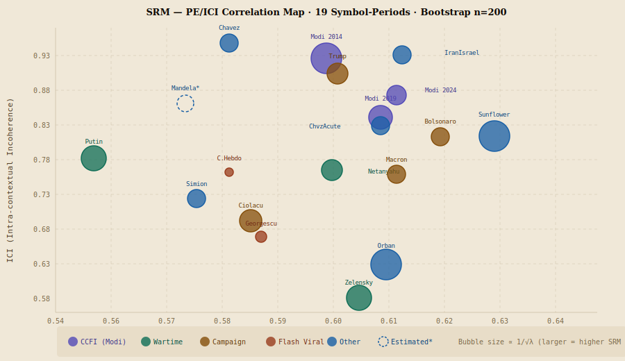
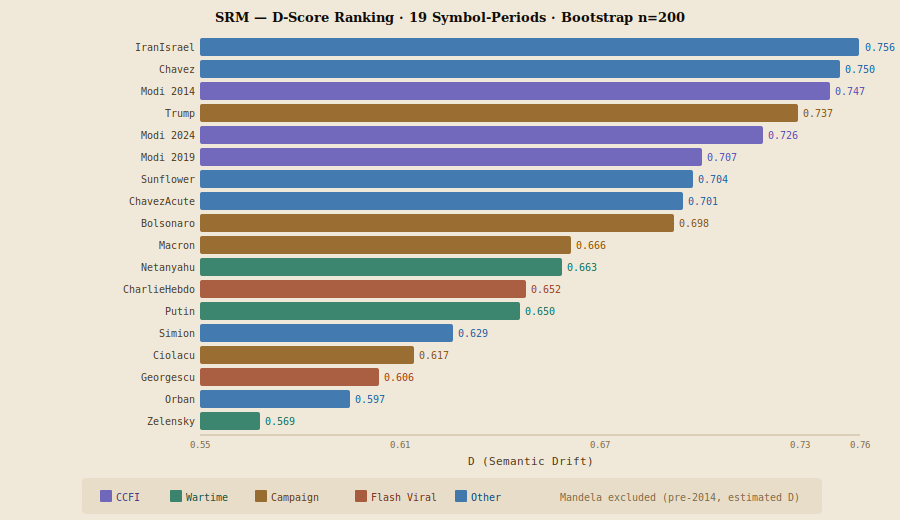

# Politomorphism — Social Resonance Model (SRM)

**Serban Gabriel Florin** | I.Researcher  
ORCID: [0009-0000-2266-3356](https://orcid.org/0009-0000-2266-3356) | DOI: [10.17605/OSF.IO/HYDNZ](https://doi.org/10.17605/OSF.IO/HYDNZ)  
GitHub: [profserbangabriel-del/Politomorphism](https://github.com/profserbangabriel-del/Politomorphism) | License: CC BY 4.0

> **Status (April 2026):** 22/22 symbol-periods validated · Bootstrap n=200 · Paper under review at JCSS

---

## PE/ICI Correlation Map

> Interactive version: [srm_pe_ici_map_interactive.html](https://profserbangabriel-del.github.io/Politomorphism/srm_pe_ici_map_interactive.html) | **Key finding:** ICI range (0.385) is **6.8x larger** than PE range (0.057). Zelensky is the only symbol with ICI < PE — wartime frame convergence confirmed empirically.

---

## D-Score Ranking

---

## What is Politomorphism?

Politomorphism treats political symbols as **morphogenetic agents** — entities that transform power structures through symbolic diffusion. The **Social Resonance Model (SRM)** quantifies how effectively a political symbol mobilizes public space across Anglo-American media.

SRM = V x A x e^(-lambda x D) x N

| Variable | Name | What it measures | Range |
|----------|------|-----------------|-------|
| V | Viral Velocity | Log-normalized escalation ratio from article time series | 0-1 |
| A | Affective Weight | Mean absolute VADER compound sentiment on article titles | 0-1 |
| D | Semantic Drift | D = alpha x PE + (1-alpha) x ICI, alpha=0.5 (primary) | 0-1 |
| N | Network Coverage | Proportion of days with at least 1 article in corpus window | 0-1 |
| lambda | Decay Constant | Empirically calibrated from Google Trends avg/peak ratio | 2-105 |

---

## Complete Dataset — 22 Symbol-Periods (Bootstrap n=200)

| Rank | Symbol | Country | Period | PE | ICI | D | V | A | N | lambda | SRM | Typology |
|------|--------|---------|--------|----|-----|---|---|---|---|--------|-----|----------|
| 1 | IranIsrael | INT | 2024 | 0.604 | 0.909 | 0.756 | 0.778 | 0.295 | 0.396 | 17.81 | ~0 | Geopolitical Event |
| 2 | Chavez | VE | 2013 | 0.572 | 0.927 | 0.750 | 0.917 | 0.258 | 0.402 | 16.67 | ~0 | Volatile Legacy |
| 3 | Modi 2014 | IN | 2014 | 0.590 | 0.904 | 0.747 | 0.132 | 0.221 | 0.144 | 2.37 | 0.000714 | CCFI Acute |
| 4 | Trump | US | 2015-16 | 0.592 | 0.881 | 0.737 | 0.786 | 0.222 | 0.559 | 7.01 | 0.000559 | Western Ceiling |
| 5 | Modi 2024 | IN | 2024 | 0.603 | 0.849 | 0.726 | 0.383 | 0.237 | 0.529 | 9.11 | 0.000065 | CCFI Asymptote |
| 6 | Modi 2019 | IN | 2019 | 0.600 | 0.815 | 0.707 | 0.194 | 0.184 | 0.632 | 6.33 | 0.000256 | CCFI Decay |
| 7 | Sunflower | TW | 2014 | 0.621 | 0.787 | 0.704 | 0.091 | 0.195 | 0.971 | 2.00 | 0.00419 | Civic Mobilization |
| 8 | ChavezAcute | VE | Mar 2013 | 0.600 | 0.802 | 0.701 | — | — | — | 16.67 | — | Dual-Mode |
| 9 | Bolsonaro | BR | 2022-23 | 0.611 | 0.786 | 0.698 | 0.550 | 0.059 | 0.478 | 10.43 | 0.000011 | Partial CCFI |
| 10 | Duterte | PH | 2016 | 0.593 | 0.796 | 0.695 | 0.395 | 0.246 | 0.275 | 5.02 | 0.000599 | CCFI Partial |
| 11 | Buhari | NG | 2015 | 0.602 | 0.778 | 0.690 | 0.463 | 0.246 | 0.116 | 7.95 | ~0 | CCFI Partial |
| 12 | Macron | FR | 2017 | 0.603 | 0.729 | 0.666 | 0.478 | 0.085 | 0.570 | 12.53 | 0.000006 | Campaign |
| 13 | Netanyahu | IL | 2023-24 | 0.591 | 0.735 | 0.663 | 0.428 | 0.144 | 0.825 | 7.02 | 0.000485 | Pre-sorted Wartime |
| 14 | CharlieHebdo | FR | 2015 | 0.572 | 0.732 | 0.652 | 0.531 | 0.140 | 0.833 | 104.66 | 0.0 | Extreme Flash Viral |
| 15 | Putin | RU | 2022 | 0.547 | 0.753 | 0.650 | 0.503 | 0.108 | 0.402 | 4.90 | 0.000904 | Wartime Aggressor |
| 16 | Erdogan | TR | 2013 | 0.584 | 0.646 | 0.615 | 0.514 | 0.104 | 0.326 | 18.52 | ~0 | Pre-sorted (discrim.) |
| 17 | Simion | RO | 2024 | 0.566 | 0.692 | 0.629 | — | — | — | 12.41 | — | Volatile |
| 18 | Ciolacu | RO | 2024-25 | 0.576 | 0.658 | 0.617 | — | — | — | 6.57 | — | Campaign |
| 19 | Georgescu | RO | 2024 | 0.578 | 0.634 | 0.606 | — | — | — | 65.33 | ~0 | Flash Viral |
| 20 | Orban | HU | 2022 | 0.601 | 0.592 | 0.597 | — | — | — | 2.31 | — | Institutional |
| 21 | Zelensky | UA | 2022 | 0.596 | 0.542 | 0.569 | — | — | — | 5.11 | — | Wartime Defender |
| — | Mandela | ZA | 2013 | 0.564 | 0.836 | —* | — | — | — | 19.66 | — | Legacy |

*Mandela (2013) predates Media Cloud indexing. Duterte2016, Buhari2015, Erdogan2013 added as CCFI-partial/discriminating cases (Jobs #90-#95). All D: bootstrap n=200.

---

## lambda Calibration

    avg / peak = (1 - e^(-lambda x T)) / (lambda x T)   solved via scipy.optimize.brentq

| Category | lambda range | Symbols |
|----------|-------------|---------|
| Institutionally Durable | 2-5 | Sunflower (2.00), Orban (2.31), Modi 2014 (2.37), Duterte (5.02), Putin (4.90), Zelensky (5.11) |
| Campaign / Ascension | 6-8 | Modi 2019 (6.33), Ciolacu (6.57), Trump (7.01), Netanyahu (7.02), Buhari (7.95) |
| Electorally Volatile | 9-20 | Modi 2024 (9.11), Bolsonaro (10.43), Simion (12.41), Macron (12.53), Chavez (16.67), IranIsrael (17.81), Erdogan (18.52), Mandela (19.66) |
| Flash Viral | 50-70 | Georgescu (65.33) |
| Extreme Flash Viral | >70 | CharlieHebdo (104.66) |

**lambda ranges from 2.00 to 104.66 — a 52-fold variation.** Log-log regression: beta_lambda = -3.50, p < 0.001, R2_adj = 0.87.

---

## D Operationalization

D = alpha x PE + (1-alpha) x ICI

| Component | Method | Measures |
|-----------|--------|----------|
| PE | Mean Jensen-Shannon Divergence on LDA (K=10, seed=42) | Topical breadth |
| ICI | 1 minus mean pairwise cosine similarity (paraphrase-multilingual-MiniLM-L12-v2) | Framing divergence |

alpha = 0.5 (primary — equal weighting, no circularity). alpha_opt = 0.389 reported as exploratory supplementary analysis only.

---

## Cross-Cultural Frame Incompatibility (CCFI)

CCFI applies when Anglo-American journalism **lacks pre-established interpretive categories**, forcing outlets to construct incompatible frameworks from scratch. The core mechanism is categorical absence, not geographic origin.

### CCFI Lifecycle — Modi Longitudinal Series (First Empirical Test in Literature)

| Phase | Year | ICI | D | lambda | SRM |
|-------|------|-----|---|--------|-----|
| CCFI acute | 2014 | 0.904 | 0.747 | 2.37 | 0.000714 |
| CCFI decay | 2019 | 0.815 | 0.707 | 6.33 | 0.000256 |
| CCFI asymptote | 2024 | 0.849 | 0.726 | 9.11 | 0.000065 |

**Active war + controversy does not equal CCFI.** Netanyahu (ICI=0.735) has pre-established Israel-Palestine frameworks — pre-sorted moderate ICI, not CCFI. Erdogan 2013 (ICI=0.646) confirms: Gezi Park was rapidly absorbed into existing authoritarian/democracy framework — pre-sorted, not CCFI.

### H2 Statistical Test (n=6 CCFI vs n=16 non-CCFI)

Welch t = 2.17, p = 0.043, Cohen d = 0.872 (large effect)  
CCFI group: M = 0.808, SD = 0.052 | Non-CCFI group: M = 0.731, SD = 0.114

---

## Key Empirical Findings

1. **ICI dominance:** ICI range 6.8x larger than PE range. r(ICI, D) = 0.51, r(PE, D) = -0.02.
2. **CCFI confirmed:** H2 p = 0.043, d = 0.872. CCFI group (Duterte, Buhari, Bolsonaro, Modi x3) significantly higher ICI than non-CCFI.
3. **CCFI lifecycle:** Modi 2014 to 2019 to 2024: ICI 0.904 to 0.815 to 0.849, lambda 2.37 to 6.33 to 9.11, SRM 11x decrease.
4. **V·A Paradox:** CharlieHebdo (V=0.531, A=0.140, N=0.833) — SRM=0.0 due to lambda=104.66.
5. **Wartime convergence:** Zelensky ICI=0.542 < PE=0.596 — only symbol with ICI<PE. Crisis unifies frames.
6. **Log-log regression:** log(SRM) = 3.09 - 3.50 x log(lambda) + 1.57 x log(V x A x N), R2_adj=0.87, p<0.001.
7. **LOOCV validation:** R2_loocv = 0.770 vs R2_adj = 0.843 (drop = 0.073, below 0.10 threshold). Minimal overfitting.
8. **Highest SRM:** Sunflower (SRM=0.00419) — low lambda + N=0.971 (97% day coverage).

---

## ICI Architecture — Seven Structural Levels

| Level | ICI range | Symbols | Mechanism |
|-------|-----------|---------|-----------|
| CCFI acute | 0.90+ | Chavez (0.927), IranIsrael (0.909), Modi 2014 (0.904) | No pre-established frameworks |
| Western ICI ceiling | 0.83-0.89 | Trump (0.881), Mandela (0.836) | Electoral / legacy / aggressor |
| CCFI asymptote | 0.79-0.85 | Modi 2024 (0.849), Modi 2019 (0.815), Duterte (0.796), ChavezAcute (0.802) | Irreducible residual |
| CCFI partial | 0.77-0.79 | Buhari (0.778), Bolsonaro (0.786), Sunflower (0.787) | Partial cultural framing |
| Pre-sorted moderate | 0.69-0.74 | Netanyahu (0.735), CharlieHebdo (0.732), Macron (0.729) | Institutionalized sorting |
| Convergent | 0.59-0.70 | Simion (0.692), Erdogan (0.646), Ciolacu (0.658), Georgescu (0.634) | Flash decay / sorting |
| Institutional stable | 0.54-0.60 | Orban (0.592), Zelensky (0.542) | Long-term convergence |

---

## Pipeline Scripts

| Script | Purpose |
|--------|---------|
| scripts/compute_D.py | PE + ICI + bootstrap CI (n=200) |
| scripts/compute_V_A_N.py | Automatic V (from lambda), A (VADER), N (article coverage) |
| scripts/calibrate_alpha.py | alpha optimization — 22/22 real values |
| scripts/test_hypotheses.py | H1/H2/H3 statistical tests |
| scripts/loocv_srm.py | Leave-One-Out CV for log-log regression |

    .github/workflows/srm_compute_D.yml
      Fetch Media Cloud corpus (2000-4000 articles)
      compute_D.py  — PE, ICI, D, bootstrap CI (n=200)
      compute_V_A_N.py  — V, A, N, SRM
      calibrate_alpha.py + test_hypotheses.py
      Upload ZIP artifact (90 days) + git push

---

## EEF — Entropic Equilibrium Function

The **Entropic Equilibrium Function (EEF)** is the second validated component of the Politomorphism Engine. It measures political systemic instability as Shannon entropy over institutional state distributions.

    S(t) = -sum( p_i(t) * log(p_i(t)) )    Shannon entropy
    S_max = log(N)                           maximum entropy for N states
    ratio = S(t) / S_max                     normalized instability score

    dS/dt = Pi(t) - Phi(t)
      Pi(t)  = disorder-generating forces (crises, conflicts, disruptive events)
      Phi(t) = order-restoring forces (reforms, institutional adaptation)

    Equilibrium: dS/dt = 0

**Entropy zones:**

| S(t)/S_max | Zone | Interpretation |
|---|---|---|
| > 80% | CRITICAL | Structural instability; disorder exceeds self-regulation |
| 60-80% | HIGH | Significant fragmentation; reform capacity under strain |
| 40-60% | MODERATE | Manageable tensions; stress containable |
| < 40% | LOW | System near equilibrium |

**Cross-national results (2024):**

| Country | Justice | Electoral | Coalition | Aggregate | Zone |
|---------|---------|-----------|-----------|-----------|------|
| Romania | 90.8% | 82.7% | 80.7% | 84.7% | CRITICAL |
| Hungary | 73.0% | 94.6% | 62.6% | 76.7% | HIGH |
| Poland | 97.1% | 84.3% | 88.7% | 90.1% | CRITICAL |

Sources: Freedom House NIT 2024; BTI 2026; EC Rule of Law 2024; Venice Commission 2024; INSCOP January 2026; EU Justice Scoreboard 2025.

Sensitivity analysis: Critical entropy classification robust to plus or minus 10% perturbations across all domains simultaneously.

Scripts: eef/compute_eef.py  
Configs: eef/config_eef_romania.json | eef/config_eef_hungary.json | eef/config_eef_poland.json

Run:

    python eef/compute_eef.py --config eef/config_eef_romania.json

---

## Repository Structure

    Politomorphism/
    .github/workflows/
        srm_compute_D.yml         Full pipeline (Jobs #33-#95)
        fetch_trends.yml          lambda calibration
    scripts/
        compute_D.py              D = alpha x PE + (1-alpha) x ICI
        compute_V_A_N.py          V, A, N automatic
        calibrate_alpha.py        alpha_opt = 0.389 (exploratory)
        test_hypotheses.py        H1/H2/H3
        loocv_srm.py              LOOCV validation
    eef/
        compute_eef.py            EEF scores + sensitivity analysis
        config_eef_romania.json   Romania 2024 baseline
        config_eef_hungary.json   Hungary 2024 validation
        config_eef_poland.json    Poland 2024 validation
        README.md                 EEF documentation
    D_result_*.json               Bootstrap n=200 (22 symbols)
    V_A_N_*.json                  V, A, N, SRM per symbol
    srm_pe_ici_map.svg            PE/ICI scatter plot (static)
    srm_d_ranking.svg             D-score bar chart (static)
    srm_pe_ici_map_interactive.html  Interactive charts (GitHub Pages)
    index.html                    GitHub Pages site
    README.md

---

## Reproducibility

- **Data:** mediacloud.org (English-language Anglo-American) + Google Trends
- **lambda:** scipy.optimize.brentq, Python 3.11, GitHub Actions ubuntu-latest
- **Sentiment:** VADER on article titles | **Embeddings:** paraphrase-multilingual-MiniLM-L12-v2
- **LDA:** scikit-learn, K=10, random_state=42 | **Bootstrap:** n=200, Jobs #33-#95
- **No local environment required** — all SRM analyses run via GitHub Actions
- **EEF:** Python >= 3.10, no external dependencies, run locally with compute_eef.py

> **Limitation:** Anglo-American English corpus only. Mandela (2013) predates Media Cloud. All associations correlational; causal interpretation requires experimental designs.

---

## Citation

OSF: [10.17605/OSF.IO/HYDNZ](https://doi.org/10.17605/OSF.IO/HYDNZ)

    @misc{serban2026politomorphism,
      author  = {Serban, Gabriel Florin},
      title   = {Politomorphism: Social Resonance Model and Entropic Equilibrium Function},
      year    = {2026},
      doi     = {10.17605/OSF.IO/HYDNZ},
      url     = {https://github.com/profserbangabriel-del/Politomorphism},
      orcid   = {0009-0000-2266-3356},
      license = {CC BY 4.0}
    }

---

*Politomorphism Research Project · Serban Gabriel Florin · Romania / EU · April 2026*
