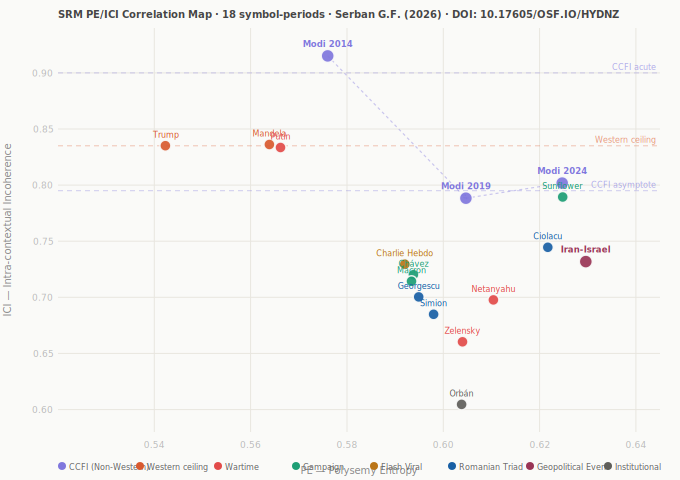

# Politomorphism — Social Resonance Model (SRM)

**Serban Gabriel Florin** | Independent Researcher  
ORCID: [0009-0000-2266-3356](https://orcid.org/0009-0000-2266-3356) | DOI: [10.17605/OSF.IO/HYDNZ](https://doi.org/10.17605/OSF.IO/HYDNZ)  
GitHub: [profserbangabriel-del/Politomorphism](https://github.com/profserbangabriel-del/Politomorphism)  
License: CC BY 4.0

---

## PE/ICI Correlation Map — 13 Validated Symbols

[](https://profserbangabriel-del.github.io/Politomorphism/srm_pe_ici_map_interactive.html)

> **Interactive version:** [srm_pe_ici_map_interactive.html](https://profserbangabriel-del.github.io/Politomorphism/srm_pe_ici_map_interactive.html) — hover over any symbol for full PE/ICI values and key findings. Filter by typology.  
> **Key finding:** ICI range (0.231) is **2.81× larger** than PE range (0.083). Framing contestation, not topical breadth, drives cross-symbol D variation.

---

## What is Politomorphism?

Politomorphism is a theoretical framework that treats political symbols as **morphogenetic agents** — entities that transform power structures through the process of symbolic diffusion. Its computational component, the **Social Resonance Model (SRM)**, provides a quantitative measure of how effectively a political symbol mobilizes public space.

---

## The SRM Formula

**SRM = V × A × e^(−λD) × N**

| Variable | Name | What it measures | Range |
|----------|------|-----------------|-------|
| V | Viral Velocity | Log-normalized escalation ratio between peak media presence and pre-event baseline | 0–1 |
| A | Affective Weight | Emotional intensity of coverage — computed via VADER (English) or DistilBERT (Romanian) sentiment analysis on article titles | 0–1 |
| D | Semantic Drift | Fragmentation of meaning across contexts. **Most impactful variable** (exponential position). Formally defined as D = α·PE + (1−α)·ICI with α_optimal = 0.351 — see Section: D Operationalization | 0–1 |
| N | Network Coverage | Proportion of days where the symbol appears in the corpus | 0–1 |
| **λ** | **Decay Constant** | Controls attenuation speed of the semantic factor. **Empirically derived from Google Trends (Step 0).** Default: λ=7 | 2–105 |

---

## How to Read the SRM Score
```
0.00 ────────────── 0.07 ──────────────── 0.20 ──────── 1.00
 LOW RESONANCE          MEDIUM RESONANCE    HIGH RESONANCE
```

> **Empirical finding (13 case studies):** The HIGH RESONANCE zone (>0.20) remains empirically vacant in open, multi-outlet Western media systems. The observed upper bound is ~0.12. HIGH RESONANCE is a theoretical anchor for perfectly coherent symbols, not a practically attainable zone in democratic media ecosystems.

---

## λ Calibration — Step 0 (Mandatory)

> **Key finding:** λ is not a universal constant. It is a typological variable ranging from **λ=2.31** (Orbán — institutionally durable) to **λ=104.66** (Charlie Hebdo — extreme flash viral). The SRM formula is unchanged; λ is now measured before any computation.

### How λ is determined

Before any SRM computation, extract Google Trends data for the analysis period and solve numerically:
```
avg / peak = (1 − e^(−λT)) / (λT)
```

where T = analysis duration in years. Solve for λ using Brent's method (`scipy.optimize.brentq`).

**Script:** [`scripts/get_trends.py`](scripts/get_trends.py) | **Data:** [`srm_lambda_calibration.json`](srm_lambda_calibration.json)

### λ Typology — Five Categories

| Category | λ range | Examples |
|----------|---------|---------|
| Institutionally Durable | 2–5 | Orbán (2.31), Putin (4.90), Zelensky (5.11) |
| Campaign / Ascension | 6–8 | Ciolacu (6.57), Trump (7.01) |
| Electorally Volatile | 12–20 | Macron (12.53), Simion (12.41), Chávez (16.67), Mandela (19.66) |
| Flash Viral | 50–70 | Georgescu (65.33) |
| Extreme Flash Viral | >70 | Charlie Hebdo (104.66) |

> **Recommended default λ = 7** (empirical median of the two fully pipeline-validated Campaign/Ascension anchors: Trump 7.01 + Ciolacu 6.57).  
> **Flash viral rule:** if λ > 30, retain λ=2 in formula and flag as flash event. SRM point estimate is unreliable at this range — only λ typology carries diagnostic value.

---

## D Operationalization — March 2026 Update

> **Key finding:** Semantic Drift (D) — the most influential SRM variable — lacked a formally documented, reproducible computation method. This has been resolved with the PE/ICI automated pipeline (GitHub Actions, `srm_compute_D.yml`, Jobs #10–#24).

### D = α · PE + (1−α) · ICI

| Component | Name | Measures | Method |
|-----------|------|----------|--------|
| PE | Polysemy Entropy | Topical breadth across domains | Mean Jensen-Shannon Divergence on LDA topic distributions (K=10, seed=42) |
| ICI | Intra-contextual Incoherence | Framing divergence across outlets | 1 − mean pairwise cosine similarity on sentence embeddings (`paraphrase-multilingual-MiniLM-L12-v2`) |

### Alpha Calibration Results (12 real-value entries)

| Parameter | Value | Interpretation |
|-----------|-------|---------------|
| α_optimal | **0.351** | ICI weight = 0.649, PE weight = 0.351 |
| Pearson r (D_new vs D_legacy) | 0.682 | p = 0.014 — significant |
| Mean D_legacy upward bias | **−15.6%** | Expert estimation systematically overestimates D |
| ICI range / PE range | **2.81×** | ICI is the primary driver of cross-symbol D variation |

### Six Cross-Symbol Findings

1. **ICI drives D variation** — ICI range (0.231) is 2.81× larger than PE range (0.083).
2. **ICI ceiling ~0.83–0.84** — Trump (0.835), Mandela (0.836), Putin (0.834) converge at the ceiling through three distinct mechanisms: electoral polarization, wartime aggressor framing, post-mortem legacy contestation.
3. **ICI−PE as typological dimension** — gradient from Trump (+0.293) to Orbán (+0.001) maps coherently onto political symbol typologies.
4. **H1 directionally supported** — both Flash Viral symbols (Charlie Hebdo +0.138, Georgescu +0.106) have ICI > PE.
5. **H3 reformulated** — wartime produces asymmetric ICI amplification (Putin +0.267) not Zelensky ICI suppression (+0.056).
6. **Systematic D_legacy upward bias** — all 11 symbols with prior estimates show D_new < D_legacy (mean Δ = −15.6%).

**Module:** [`scripts/compute_D.py`](scripts/compute_D.py) | [`scripts/calibrate_alpha.py`](scripts/calibrate_alpha.py)

---

## Complete PE/ICI Dataset — 13 Validated Symbols

| Rank | Symbol | Country | Period | PE | ICI | D_new | ICI−PE | SRM (λ=2) | Typology |
|------|--------|---------|--------|----|-----|-------|--------|-----------|----------|
| 1 | Trump | USA | 2015–16 | 0.5423 | 0.8351 | 0.6887 | +0.293 | 0.0922 | Campaign |
| 2 | Mandela | ZA | 2013 | 0.5639 | 0.8362 | 0.7001 | +0.272 | 0.0088 | Legacy |
| 3 | Putin | RU | 2022 | 0.5662 | 0.8335 | 0.6999 | +0.267 | 0.0103 | Wartime Aggressor |
| 4 | Sunflower Mvt | TW | 2014 | 0.6248 | 0.7894 | 0.7071 | +0.165 | 0.0376 | Civic Mobilization |
| 5 | Charlie Hebdo | FR | 2015 | 0.5920 | 0.7295 | 0.6607 | +0.138 | ~0 | Flash Viral |
| 6 | Chávez | VE | 2013 | 0.5938 | 0.7202 | 0.6570 | +0.126 | 0.0121 | Electorally Volatile |
| 7 | Ciolacu | RO | 2025–26 | 0.6217 | 0.7446 | 0.6832 | +0.123 | 0.0365 | Campaign/Post-exec. |
| 8 | Macron | FR | 2017 | 0.5934 | 0.7143 | 0.6539 | +0.121 | 0.0169 | Campaign |
| 9 | Georgescu | RO | 2024 | 0.5949 | 0.7004 | 0.6477 | +0.106 | 0.0307 | Flash Viral |
| 10 | Simion | RO | 2024 | 0.5980 | 0.6849 | 0.6414 | +0.087 | 0.0054 | Electorally Volatile |
| 11 | Zelensky | UA | 2022 | 0.6040 | 0.6604 | 0.6322 | +0.056 | 0.1121 | Wartime Defender |
| 12 | Orbán | HU | 2022 | 0.6038 | 0.6046 | 0.6042 | +0.001 | 0.0065 | Institutionally Durable |
| — | Chávez (acute) | VE | Mar 2013 | — | — | 0.380* | — | 0.1154* | Dual-Mode |

*Estimated. All other D_new values are real pipeline outputs (Jobs #10–#24).

---

## Dual-Mode SRM and Acute Amplification Factor (AAF)

For symbols with identifiable acute crisis windows (deaths, elections, coups), two SRM scores are reported:

- **SUSTAINED SRM** — long-term fragmented presence
- **ACUTE SRM** — short-term mobilization during narrative coherence

**AAF = ACUTE SRM / SUSTAINED SRM**

For Hugo Chávez: AAF = 9.5 (SRM jumped from 0.0121 to 0.1154 as D collapsed from 0.720 to 0.380 during the 11-day death window). This metric is now recommended for all symbols with identifiable acute windows.

---

## The 13 Typological Categories

| # | Category | Example | ICI−PE | Mechanism |
|---|----------|---------|--------|-----------|
| 1 | Fragmented Diffusion | Călin Georgescu | +0.106 | High visibility, extreme ICI, politically inert |
| 2 | Post-Executive Symbolic Trap | Marcel Ciolacu | +0.123 | Role transition generates structural semantic fragmentation |
| 3 | High-Velocity Campaign | Donald Trump | +0.293 | Exceptional V, maximum ICI-dominance |
| 4 | Sustained Wartime Defender | Volodymyr Zelensky | +0.056 | Crisis frame convergence, moderate ICI |
| 5 | Wartime Aggressor | Vladimir Putin | +0.267 | Moral-political polarization amplifies ICI to ceiling |
| 6 | Longevity Saturation | Viktor Orbán | +0.001 | 15+ years — perfectly balanced PE/ICI |
| 7 | Legacy Resonance | Nelson Mandela | +0.272 | Post-mortem Legacy Contestation ICI — highest absolute ICI |
| 8 | Rapid Emergence | Emmanuel Macron | +0.121 | Contradictory frame coexistence ≈ Ciolacu |
| 9 | Civic Mobilization | Sunflower Movement | +0.165 | Cross-cultural framing diversity |
| 10 | Flash Viral | Călin Georgescu / Charlie Hebdo | +0.106/+0.138 | Convergence-then-contestation |
| 11 | Revolutionary Legacy | Hugo Chávez | +0.126 | Structured ICI; SUSTAINED Low + ACUTE Medium; AAF=9.5 |
| 12 | Extreme Flash Viral | Charlie Hebdo | +0.138 | λ=104.66; ICI ceiling not reached |
| 13 | Electorally Volatile | Simion, Chávez | +0.087/+0.126 | Structured ideological sorting |

---

## Comparative Dataset — Full SRM Variables

| Symbol / Context | V | A | D_new | N | SRM (λ=2) | λ empiric | SRM (λ_emp) | Typology |
|------------------|---|---|-------|---|-----------|----------|------------|---------|
| George Simion (RO, 2024–26) | 0.279 | 0.099 | 0.641 | 0.996 | 0.0054 | 12.41 | — | Electorally Volatile |
| Viktor Orbán (HU, 2022–26) | 0.168 | 0.236 | 0.604 | 0.812 | 0.0065 | 2.31 | 0.0051 | Longevity Saturation |
| Nelson Mandela (SA, 2013) | 0.311 | 0.246 | 0.700 | 0.510 | 0.0088 | 19.66 | — | Legacy Resonance |
| Vladimir Putin (2022–26) | 0.217 | 0.259 | 0.700 | 1.000 | 0.0103 | 4.90 | 0.0009 | Wartime Aggressor |
| Hugo Chávez SUSTAINED (VE, 2012–13) | 0.186 | 0.290 | 0.657 | 0.941 | 0.0121 | 16.67 | — | Revolutionary Legacy |
| Emmanuel Macron (FR, 2017) | 0.507 | 0.168 | 0.654 | 1.000 | 0.0169 | 12.53 | — | Rapid Emergence |
| Călin Georgescu (RO, 2024) | 0.750 | 0.398 | 0.648 | 0.600 | 0.0307 | 65.33 | — | Flash Viral |
| Marcel Ciolacu (RO, 2025–26) | 0.720 | 0.420 | 0.683 | 0.650 | 0.0365 | 6.57 | 0.0008 | Post-Executive Trap |
| Sunflower Movement (TW, 2014) | 0.680 | 0.420 | 0.707 | 0.580 | 0.0376 | — | — | Civic Mobilization |
| Charlie Hebdo (FR, 2015) | TBD | TBD | 0.661 | TBD | TBD | 104.66 | — | Extreme Flash Viral |
| Donald Trump (US, 2015–16) | 0.958 | 0.580 | 0.689 | 0.720 | 0.0922 | 7.01 | 0.0023 | High-Velocity Campaign |
| Hugo Chávez ACUTE (VE, Mar 2013) | 0.689 | 0.358 | 0.380* | 1.000 | 0.1154 | 16.67 | — | Revolutionary Legacy (Acute) |
| Volodymyr Zelensky (UA, 2022–26) | 0.873 | 0.640 | 0.632 | 0.781 | 0.1121 | 5.11 | 0.0135 | Wartime Defender |

*D_acute = 0.380 is an expert estimate pending dedicated acute-window corpus run. All other D_new values are real pipeline outputs.  
Zelensky reclassified **LOW RESONANCE** under empirical λ=5.11 (SRM_emp=0.0135). MEDIUM classification applies only at λ=2.

---

## Case Studies

### Case Study 1 — Sunflower Movement (Taiwan, 2014)

Data: Media Cloud | 92 days | λ unavailable (GT global avg=1.1, insufficient resolution)

| V | A | D_new | N | SRM | Job |
|---|---|-------|---|-----|-----|
| 0.680 | 0.420 | 0.707 | 0.580 | 0.0376 | #15 |

**Key contribution:** First proof that high visibility does not guarantee resonance. Highest D_new (0.707) in dataset — cross-cultural civic mobilization drives framing diversity. ICI−PE = +0.165 (rank 4/13).

Data: [`data_sunflower/`](data_sunflower/)

---

### Case Study 2 — Călin Georgescu (Romania, Oct–Dec 2024)

Data: Media Cloud Romanian National + State & Local | 151 days

| V | A | D_new | N | SRM | λ emp | Job |
|---|---|-------|---|-----|-------|-----|
| 0.750 | 0.398 | 0.648 | 0.600 | 0.0307 | 65.33 | #14 |

**Key contribution:** Flash Viral category. Largest D discrepancy in dataset (D_legacy=0.881 vs D_new=0.648, Δ=−26.5%). λ>30 triggers the flash viral rule. ICI−PE = +0.106 (rank 9/13). Romanian Triad.

Results: [`SRM_raport_final.json`](SRM_raport_final.json) | [`SRM_grafic_final.png`](SRM_grafic_final.png)

---

### Case Study 3 — Marcel Ciolacu (Romania, Dec 2025 – Mar 2026)

Data: Media Cloud Romania National + State & Local | 339 articles | 91 days

| V | A | D_new | N | SRM | λ emp | SRM (λ_emp) | Job |
|---|---|-------|---|-----|-------|------------|-----|
| 0.720 | 0.420 | 0.683 | 0.650 | 0.0365 | 6.57 | 0.0008 | #12 |

**Key contribution:** Post-Executive Symbolic Trap. ICI−PE = +0.123 ≈ Macron (+0.121) — structural equivalence between contradictory frame coexistence mechanisms across different national contexts. Romanian Triad.

Paper: [`SRM_Ciolacu_Validation.docx`](SRM_Ciolacu_Validation.docx)

---

### Case Study 4 — Donald Trump (USA, Jun 2015 – Nov 2016)

Data: Media Cloud US National + State & Local | 69,997 articles | 548 daily observations

| V | A | D_new | N | SRM | λ emp | SRM (λ_emp) | Job |
|---|---|-------|---|-----|-------|------------|-----|
| 0.958 | 0.580 | 0.689 | 0.720 | 0.0922 | 7.01 | 0.0023 | #10 |

**Key contribution:** First Medium Resonance case. Highest ICI-dominance in dataset (ICI−PE = +0.293, rank 1/13). ICI = 0.835 — reaches the ICI ceiling through domestic electoral polarization. Largest corpus: 69,997 articles.

Results: [`SRM_trump_result.json`](SRM_trump_result.json)

---

### Case Study 5 — Volodymyr Zelensky (UA/EU/US, Feb 2022 – Mar 2026)

Data: Media Cloud US National + Europe | 1,489 daily observations

| V | A | D_new | N | SRM (λ=2) | λ emp | SRM (λ_emp) | Job |
|---|---|-------|---|-----------|-------|------------|-----|
| 0.873 | 0.640 | 0.632 | 0.781 | 0.1121 | 5.11 | 0.0135 | #17 |

**Key contribution:** H3 reformulated — not Zelensky ICI suppression but Putin ICI amplification on identical Feb–Jun 2022 corpus. Wartime Antagonistic Pair. ICI−PE = +0.056 (rank 11/13). A=0.640 highest in dataset.

Paper: [`SRM_Zelensky_Validation.docx`](SRM_Zelensky_Validation.docx)

---

### Case Study 6 — Vladimir Putin (2022–2026)

Data: Media Cloud US National + US State & Local | 1,489 daily observations

| V | A | D_new | N | SRM | λ emp | SRM (λ_emp) | Job |
|---|---|-------|---|-----|-------|------------|-----|
| 0.217 | 0.259 | 0.700 | 1.000 | 0.0103 | 4.90 | 0.0009 | #18 |

**Key contribution:** ICI = 0.834 ≈ Trump (0.835) — structural equivalence between domestic electoral polarization and wartime aggressor moral amplification. Antagonistic Pair with Zelensky (identical corpus). ICI−PE = +0.267 (rank 3/13).

Paper: [`SRM_Putin_Validation.docx`](SRM_Putin_Validation.docx)

---

### Case Study 7 — George Simion (Romania, Oct 2024 – Mar 2026)

Data: Media Cloud Romanian National + State & Local | 516 daily observations

| V | A | D_new | N | SRM | λ emp | Job |
|---|---|-------|---|-----|-------|-----|
| 0.279 | 0.099 | 0.641 | 0.996 | 0.0054 | 12.41 | #19 |

**Key contribution:** Affective Deficit — A=0.099 (lowest in dataset) is the binding SRM constraint, not D. Completes the **Romanian Triad** (Georgescu + Ciolacu + Simion). PE convergence confirmed (Triad PE SD=0.012 vs dataset 0.026).

Paper: [`SRM_Simion_Validation.docx`](SRM_Simion_Validation.docx)

---

### Case Study 8 — Viktor Orbán (Hungary, 2022–2026)

Data: Media Cloud US National + US State & Local + European | 1,520 daily observations

| V | A | D_new | N | SRM | λ emp | SRM (λ_emp) | Job |
|---|---|-------|---|-----|-------|------------|-----|
| 0.168 | 0.236 | 0.604 | 0.812 | 0.0065 | 2.31 | 0.0051 | #16 |

**Key contribution:** ICI−PE = +0.001 ≈ 0 — perfectly balanced profile, the structural signature of Institutionally Durable symbols. Longevity Paradox: V=0.168 (lowest) + D_new=0.604 (lowest) makes Low Resonance overdetermined.

Paper: [`SRM_Orban_Validation.docx`](SRM_Orban_Validation.docx)

---

### Case Study 9 — Nelson Mandela (South Africa, 2013)

Data: Media Cloud US National + US State & Local | 4,000 articles | VADER corpus: 4,070 English titles

| V | A | D_new | N | SRM | λ emp | Job |
|---|---|-------|---|-----|-------|-----|
| 0.311 | 0.246 | 0.700 | 0.510 | 0.0088 | 19.66 | #20 |

**Key contribution:** Highest absolute ICI (0.836) in dataset despite being a universally celebrated icon — introduces **Legacy Contestation ICI** concept. ICI Ceiling co-occupant. Affectively compatible but semantically incompatible frames (hagiographic vs. critical reassessment).

Paper: [`SRM_Mandela_Validation.docx`](SRM_Mandela_Validation.docx)

---

### Case Study 10 — Emmanuel Macron (France, 2017)

Data: Media Cloud US National + Europe Media Monitor | 365 daily observations | VADER corpus: 1,304 English titles

| V | A | D_new | N | SRM | λ emp | Job |
|---|---|-------|---|-----|-------|-----|
| 0.507 | 0.168 | 0.654 | 1.000 | 0.0169 | 12.53 | #21 |

**Key contribution:** Rapid Emergence Paradox — V=0.507 (3rd highest overall) but SRM stays Low. ICI−PE = +0.121 ≈ Ciolacu (+0.123) — structural equivalence across different national contexts through contradictory frame coexistence.

Paper: [`SRM_Macron_Validation.docx`](SRM_Macron_Validation.docx)

---

### Case Study 11 — Hugo Chávez (Venezuela, 2012–2013)

Data: Media Cloud US National | 2,000 articles (Mar–Dec 2013) | VADER corpus: 3,073 English titles  
Google Trends: avg=3.0, peak=100 → **λ empiric = 16.67** (Electorally Volatile)

| Mode | V | A | D | N | SRM (λ=2) | Job |
|------|---|---|---|---|-----------|-----|
| SUSTAINED (Nov 2012–Dec 2013) | 0.186 | 0.290 | 0.657 | 0.941 | 0.0121 | #22 |
| **ACUTE (Mar 5–15, 2013)** | **0.689** | **0.358** | **0.380*** | **1.000** | **0.1154** | est. |

**Key contribution:** Dual-Mode SRM framework. AAF = 9.5. ICI−PE = +0.126 — Structured Revolutionary ICI, lower than Mandela (+0.272) despite same year 2013 — pre-sorted ideological frames vs. unstructured legacy contestation.

Paper: [`SRM_Chavez_Validation.docx`](SRM_Chavez_Validation.docx)

---

### Case Study 12 — Charlie Hebdo (France, Jan–Feb 2015)

Data: Media Cloud | 2,000 articles | Google Trends: avg=6.82, peak=711, T=0.997 years  
**λ empiric = 104.66** (Extreme Flash Viral)

| V | A | D_new | N | SRM (λ=2) | λ emp | Job |
|---|---|-------|---|-----------|-------|-----|
| TBD | TBD | 0.661 | TBD | TBD | 104.66 | #24 |

**Key contribution:** Flash Viral rank 1 (ICI=0.730, ICI−PE=+0.138). λ=104.66 is the highest in the dataset. H1 directionally confirmed: both Flash Viral symbols have ICI > PE. Convergence-then-contestation mechanism.

Paper: [`SRM_CharlieHebdo_SSRN_2026.docx`](SRM_CharlieHebdo_SSRN_2026.docx)

---

## SSRN Publications

All papers available at DOI: [10.17605/OSF.IO/HYDNZ](https://doi.org/10.17605/OSF.IO/HYDNZ)

| Paper | Job | Key finding |
|-------|-----|-------------|
| Trump v2 | #10 | ICI ceiling rank 1 (+0.293) · 69,997-article corpus |
| Ciolacu v2 | #12 | Romanian Triad · PE convergence |
| Georgescu v2 | #14 | Largest D discrepancy (−26.5%) · λ-dominance |
| Sunflower v2 | #15 | Highest D_new (0.707) · cross-cultural diversity |
| Orbán v2 | #16 | ICI−PE≈0 · Longevity Paradox |
| Zelensky v2 | #17 | Wartime defender · H3 reformulated |
| Putin v2 | #18 | Antagonistic Pair · ICI≈Trump |
| Simion v2 | #19 | Affective Deficit (A=0.099) |
| Mandela v2 | #20 | Highest absolute ICI · Legacy Contestation ICI |
| Macron v2 | #21 | Rapid Emergence Paradox |
| Chávez v2 | #22 | Dual-Mode SRM · Structured vs. Unstructured ICI |
| Charlie Hebdo | #24 | Flash Viral rank 1 · λ=104.66 |
| **Synthetic Comparative** | — | **Cross-symbol synthesis · all 6 principal findings** |

---

## Repository Structure
```
politomorphism/
├── .github/workflows/
│   ├── srm_compute_D.yml
│   ├── srm_ciolacu_validation.yml
│   ├── srm_zelensky_validation.yml
│   ├── srm_putin_validation.yml
│   ├── srm_simion_validation.yml
│   ├── srm_orban_validation.yml
│   └── fetch_trends.yml
├── scripts/
│   ├── get_trends.py
│   ├── compute_D.py
│   ├── calibrate_alpha.py
│   ├── test_hypotheses.py
│   └── srm_pipeline/
├── docs/
│   ├── srm_pe_ici_map.svg
│   └── srm_pe_ici_map_interactive.html
├── results/
└── README.md
```

---

## Reproducibility

- **Data:** [mediacloud.org](https://mediacloud.org) + [Google Trends](https://trends.google.com)
- **λ calibration:** `scipy.optimize.brentq`, Python 3.11, GitHub Actions ubuntu-latest
- **Sentiment:** VADER (`vaderSentiment 3.3.2`) English; DistilBERT Romanian
- **D computation:** LDA (scikit-learn K=10 seed=42) + `paraphrase-multilingual-MiniLM-L12-v2`
- **Alpha calibration:** α_optimal=0.351, 12 real-value entries
- **Bootstrap:** n=20 (speed); publication requires n≥200

---

## Preregistration

OSF: [10.17605/OSF.IO/HYDNZ](https://doi.org/10.17605/OSF.IO/HYDNZ)  
Zenodo: [10.5281/zenodo.18962821](https://doi.org/10.5281/zenodo.18962821)

---

## Citation
```bibtex
@misc{serban2026politomorphism,
  author  = {Serban, Gabriel Florin},
  title   = {Politomorphism: Social Resonance Model — PE/ICI Decomposition across 13 Validated Political Symbols},
  year    = {2026},
  doi     = {10.17605/OSF.IO/HYDNZ},
  url     = {https://github.com/profserbangabriel-del/Politomorphism},
  license = {CC BY 4.0}
}
```

---

*Politomorphism Research Project · Serban Gabriel Florin · Romania / EU · March 2026*
