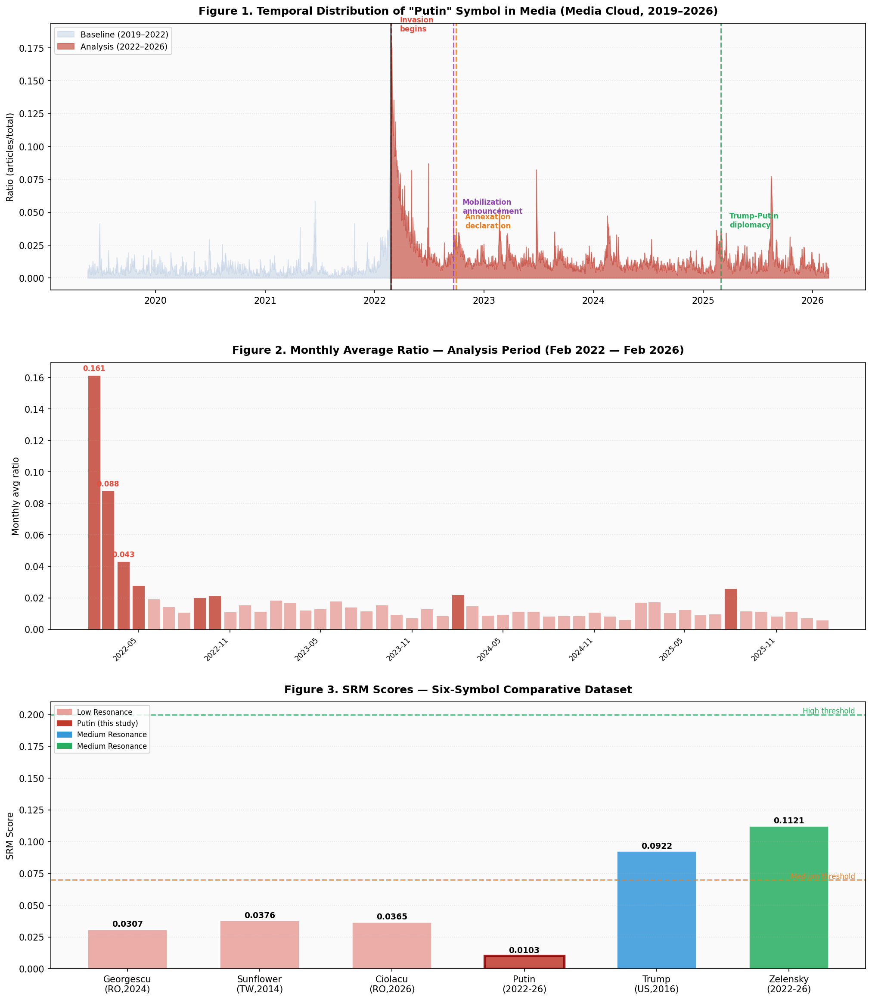
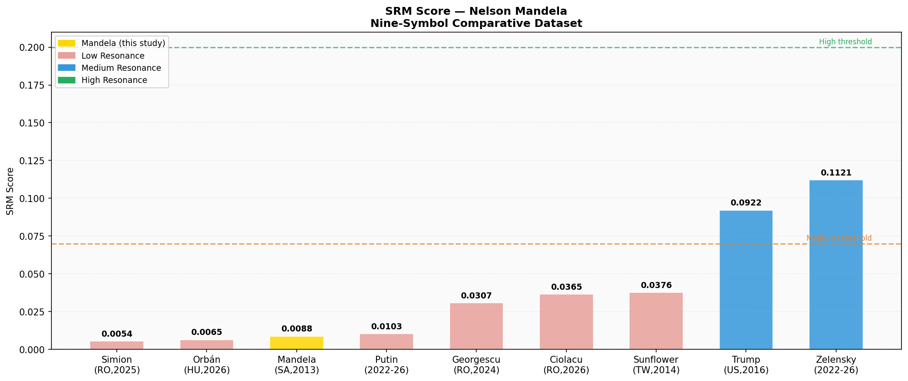
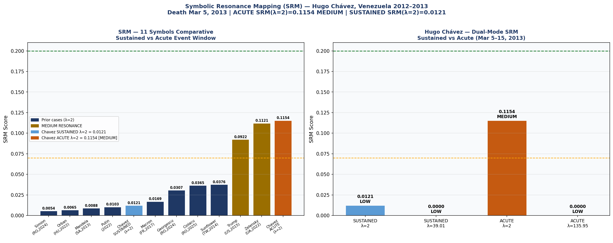

# Politomorphism — Social Resonance Model (SRM)

**Serban Gabriel Florin** | Independent Researcher  
ORCID: [0009-0000-2266-3356](https://orcid.org/0009-0000-2266-3356) | DOI: [10.17605/OSF.IO/HYDNZ](https://doi.org/10.17605/OSF.IO/HYDNZ)  
GitHub: [profserbangabriel-del/politomorphism](https://github.com/profserbangabriel-del/politomorphism)

---

## What is Politomorphism?

Politomorphism is a theoretical framework that treats political symbols as **morphogenetic agents** — entities that transform power structures through the process of symbolic diffusion. Its computational component, the **Social Resonance Model (SRM)**, provides a quantitative measure of how effectively a political symbol mobilizes public space.

---

## The SRM Formula

**SRM = V × A × e^(−λD) × N**

| Variable | Name | What it measures | Range |
|----------|------|-----------------|-------|
| V | Viral Velocity | Log-normalized escalation ratio between peak media presence and pre-event baseline | 0–1 |
| A | Affective Weight | Emotional intensity of coverage — computed via VADER sentiment analysis on article titles | 0–1 |
| D | Semantic Drift | How fragmented the symbol's meaning is across different contexts. **Most impactful variable** due to its exponential position | 0–1 |
| N | Network Coverage | Proportion of days where the symbol appears in the corpus | 0–1 |
| **λ** | **Decay Constant** | **Controls attenuation speed of the semantic factor. Now determined empirically from Google Trends (see below).** | **2–65** |

---

## λ Calibration — March 2026 Update

> **Key finding:** λ is not a universal constant. It is a typological variable ranging from **λ=2.31** (Orbán — institutionally durable) to **λ=65.33** (Georgescu — flash viral). The formula is unchanged; λ is now measured before computation.

### How λ is determined (Step 0)

Before any SRM computation, extract Google Trends data for the analysis period and solve:

```
avg / peak = (1 − e^(−λT)) / (λT)
```

where T = analysis duration in years. Solve numerically for λ (Brent's method).

### λ Typology — Four Categories

| Category | λ range | Examples |
|----------|---------|---------|
| Institutionally Durable | 2 – 5 | Orbán (2.31), Putin (4.90), Zelensky (5.11) |
| Campaign / Ascension | 6 – 8 | Trump (7.01), Ciolacu (6.57) |
| Electorally Volatile | 12 – 20 | Macron (12.53), Simion (12.41), Mandela (19.66) |
| Flash Viral | 50 – 70 | Georgescu (65.33) |

> **Recommended default:** λ=7 (empirical median from fully validated cases: Trump + Ciolacu).  
> **Flash viral rule:** if λ > 30, retain λ=2 in formula and flag as flash event.

**Paper:** [SRM_Lambda_Calibration_FULL.docx](SRM_Lambda_Calibration_FULL.docx) | **Data:** [srm_lambda_calibration.json](srm_lambda_calibration.json) | **Script:** [scripts/get_trends.py](scripts/get_trends.py)

---

## How to Read the SRM Score

| 0.00 | 0.07 | 0.20 | 1.00 |
|------|------|------|------|
| LOW RESONANCE | → | MEDIUM RESONANCE | HIGH RESONANCE |

---

## The 8 Diagnostic Categories

### 1. Fragmented Diffusion Symbol
High visibility, extreme semantic drift, politically inert. Example: **Călin Georgescu (D=0.881)**.

### 2. Post-Executive Symbolic Trap
Institutional role transition generates unavoidable semantic fragmentation. Example: **Marcel Ciolacu (D=0.841)**.

### 3. High-Velocity Campaign Symbol
Exceptional diffusion speed, moderate semantic coherence. Example: **Donald Trump (V=0.958, SRM=0.0922)**.

### 4. Sustained Wartime Medium-Resonance Symbol
Multi-year high visibility, coherence through crisis framing. Example: **Volodymyr Zelensky (D=0.680, SRM=0.1121 at λ=2)**.

### 5. Pre-Saturated Contradicted Symbol
Maximum visibility, low resonance due to acute pre-saturation and geopolitical contradiction. Example: **Vladimir Putin (V=0.217, N=1.000, SRM=0.0103)**.

### 6. Longevity Saturation Symbol
Chronic long-term media presence prevents symbolic emergence. Example: **Viktor Orbán (V=0.168, 15+ years baseline, SRM=0.0065)**.

### 7. Legacy Resonance Symbol
Acute death/memorial spike combined with near-universal semantic consensus suppresses SRM despite high V. Example: **Nelson Mandela (V=0.311, D=0.742, SRM=0.0088)**.

### 8. Rapid Emergence Symbol
Fast escalation from near-zero baseline suppressed by high Semantic Drift and low Affective Weight. Example: **Emmanuel Macron (V=0.507, D=0.810, A=0.168, SRM=0.0169)**.

---

## Comparative Dataset — 10 Validated Symbols

| Symbol / Context | V | A | D | N | SRM (λ=2) | λ empiric | SRM (λemp) | Category |
|-----------------|---|---|---|---|-----------|-----------|------------|----------|
| George Simion (RO, 2024–26) | 0.279 | 0.099 | 0.812 | 0.996 | 0.0054 | 12.41 | — | Low — Fragmented Diffusion |
| Viktor Orbán (HU, 2022–26) | 0.168 | 0.236 | 0.798 | 0.812 | 0.0065 | 2.31 | 0.0051 | Low — Longevity Saturation |
| Nelson Mandela (SA, 2013) | 0.311 | 0.246 | 0.742 | 0.510 | 0.0088 | 19.66 | — | Low — Legacy Resonance |
| Vladimir Putin (2022–26) | 0.217 | 0.259 | 0.847 | 1.000 | 0.0103 | 4.90 | 0.0009 | Low — Pre-Saturated Contradicted |
| Emmanuel Macron (FR, 2017) | 0.507 | 0.168 | 0.810 | 1.000 | 0.0169 | 12.53 | — | Low — Rapid Emergence |
| Călin Georgescu (RO, 2024) | 0.750 | 0.398 | 0.881 | 0.600 | 0.0307 | 65.33 | — | Low — Flash Viral |
| Marcel Ciolacu (RO, 2025–26) | 0.720 | 0.420 | 0.841 | 0.650 | 0.0365 | 6.57 | 0.0008 | Low — Post-Executive Trap |
| Sunflower Mvt (TW, 2014) | 0.680 | 0.420 | 0.774 | 0.580 | 0.0376 | — | — | Low — Civic Mobilization |
| Donald Trump (US, 2015–16) | 0.958 | 0.580 | 0.734 | 0.720 | 0.0922 | 7.01 | 0.0023 | Medium — High-Velocity Campaign |
| Zelensky (UA/EU/US, 2022–26) | 0.873 | 0.640 | 0.680 | 0.781 | 0.1121 | 5.11 | 0.0135 | Medium → Low* — Wartime Symbol |

*\* Zelensky reclassified LOW RESONANCE under empirical λ=5.11.*

---

## Case Studies

### Case Study 1 — Sunflower Movement (Taiwan, 2014)

| V | A | D | N | SRM | λ emp | Interpretation |
|---|---|---|---|-----|-------|----------------|
| 0.680 | 0.420 | 0.7737 | 0.580 | 0.0376 | — | LOW RESONANCE |

---

### Case Study 2 — Călin Georgescu (Romania, Oct–Dec 2024)

| V | A | D | N | SRM | λ emp | Interpretation |
|---|---|---|---|-----|-------|----------------|
| 0.750 | 0.398 | 0.8813 | 0.600 | 0.0307 | 65.33 | LOW RESONANCE — Flash Viral |

Results: [SRM_raport_final.json](SRM_raport_final.json) | Chart: [SRM_grafic_final.png](SRM_grafic_final.png)

---

### Case Study 3 — Marcel Ciolacu (Romania, Dec 2025 – Mar 2026)

Data: Media Cloud Romania National + State & Local | 339 articles | 91 days

| V | A | D | N | SRM | λ emp | Interpretation |
|---|---|---|---|-----|-------|----------------|
| 0.720 | 0.420 | 0.8412 | 0.650 | 0.0365 | 6.57 | LOW RESONANCE |

Paper: [SRM_Ciolacu_Validation.docx](SRM_Ciolacu_Validation.docx) | Data: [data_ciolacu/](data_ciolacu/)

---

### Case Study 4 — Donald Trump (USA, Jun 2015 – Nov 2016)

Data: Media Cloud US National + State & Local | 548 daily observations

| V | A | D | N | SRM | λ emp | Interpretation |
|---|---|---|---|-----|-------|----------------|
| 0.958 | 0.580 | 0.7340 | 0.720 | 0.0922 | 7.01 | MEDIUM RESONANCE |

Results: [SRM_trump_result.json](SRM_trump_result.json) | Chart: [SRM_trump_grafic.png](SRM_trump_grafic.png)

---

### Case Study 5 — Volodymyr Zelensky (UA/EU/US, Feb 2022 – Mar 2026)

Data: Media Cloud US National + Europe | 1,489 daily observations

| V | A | D | N | SRM (λ=2) | λ emp | SRM (λemp) | Interpretation |
|---|---|---|---|-----------|-------|------------|----------------|
| 0.873 | 0.640 | 0.680 | 0.781 | 0.1121 | 5.11 | 0.0135 | MEDIUM (λ=2) → LOW (λemp) |

Paper: [SRM_Zelensky_Validation.docx](SRM_Zelensky_Validation.docx) | Data: [data_zelensky/](data_zelensky/)

---

### Case Study 6 — Vladimir Putin (2022–2026)

Data: Media Cloud US National + US State & Local | 1,489 daily observations

| V | A | D | N | SRM | λ emp | Interpretation |
|---|---|---|---|-----|-------|----------------|
| 0.217 | 0.259 | 0.847 | 1.000 | 0.0103 | 4.90 | LOW RESONANCE |

**Pre-Saturation Paradox:** N=1.000 every day yet SRM=0.0103. **First Antagonistic Symbol Pair** with Zelensky — SRM gap 0.1018.



Paper: [SRM_Putin_Validation.docx](SRM_Putin_Validation_FINAL_V4.docx) | Data: [data_putin/](data_putin/)

---

### Case Study 7 — George Simion (Romania, Oct 2024 – Mar 2026)

Data: Media Cloud Romanian National + State & Local | 516 daily observations

| V | A | D | N | SRM | λ emp | Interpretation |
|---|---|---|---|-----|-------|----------------|
| 0.279 | 0.099 | 0.812 | 0.996 | 0.0054 | 12.41 | LOW RESONANCE |

**Romanian Triad:** Georgescu + Ciolacu + Simion — first within-country controlled comparison. All three produce Low Resonance. **Peak:** May 2025 (ratio=0.253) — second round of presidential elections.


Paper: [SRM_Simion_Validation.docx](SRM_Simion_Validation.docx) | Data: [data_simion/](data_simion/)

---

### Case Study 8 — Viktor Orbán (Hungary, 2022–2026)

Data: Media Cloud US National + US State & Local + European | 1,520 daily observations

| V | A | D | N | SRM | λ emp | Interpretation |
|---|---|---|---|-----|-------|----------------|
| 0.168 | 0.236 | 0.798 | 0.812 | 0.0065 | 2.31 | LOW RESONANCE |

**Longevity Paradox:** 15+ years of media presence produces V=0.168. λ empiric=2.31 confirms that λ=2 was already the correct value for this symbol — the only case in the dataset where the theoretical default was empirically validated.


Paper: [SRM_Orban_Validation.docx](SRM_Orban_Validation.docx) | Data: [data_orban/](data_orban/)

---

### Case Study 9 — Nelson Mandela (South Africa, 2013)

Data: Media Cloud US National + US State & Local | 365 daily observations  
VADER corpus: 4,070 English titles | Total articles: 11,102

| V | A | D | N | SRM | λ emp | Interpretation |
|---|---|---|---|-----|-------|----------------|
| 0.311 | 0.246 | 0.742 | 0.510 | 0.0088 | 19.66 | LOW RESONANCE |

**Legacy Paradox:** Mandela's death (Dec 5, 2013) generated the highest single-day ratio in the dataset (0.08618 on Dec 6) — yet annual SRM=0.0088. λ=19.66 confirms the death-spike structure: massive concentrated peak, rapid return to near-zero.



Paper: [SRM_Mandela_Validation.docx](SRM_Mandela_Validation.docx) | Data: [data_mandela/](data_mandela/)

---

### Case Study 10 — Emmanuel Macron (France, 2017)

Data: Media Cloud US National + Europe Media Monitor | 365 daily observations  
VADER corpus: 1,304 English titles | Total articles: 79,964

| V | A | D | N | SRM | λ emp | Interpretation |
|---|---|---|---|-----|-------|----------------|
| 0.507 | 0.168 | 0.810 | 1.000 | 0.0169 | 12.53 | LOW RESONANCE |

**Rapid Emergence Paradox:** 13.75x escalation (highest V in Low Resonance cohort) offset by low A=0.1681 and high D=0.810. λ=12.53 is identical to Simion (12.41), confirming that single-peak electoral emergence symbols share a common diffusion structure regardless of country or political context.


Paper: [SRM_Macron_Validation.docx](SRM_Macron_Validation.docx) | Data: [data_macron/](data_macron/)

---

## Repository Structure

```
politomorphism/
├── .github/workflows/
│   ├── fetch_trends.yml              ← Google Trends extraction (NEW)
│   ├── srm_ciolacu_validation.yml
│   ├── srm_zelensky_validation.yml
│   ├── srm_putin_validation.yml
│   ├── srm_simion_validation.yml
│   └── srm_orban_validation.yml
├── scripts/
│   └── get_trends.py                 ← λ calibration data extraction (NEW)
├── srm_pipeline/
│   ├── pas2_A_sentiment.py
│   ├── pas3_D_semantic_drift.py
│   ├── pas4_N_gdelt.py
│   └── pas5_SRM_final.py
├── data_macron/
├── data_mandela/
├── data_ciolacu/
├── data_sunflower/
├── data_zelensky/
├── data_putin/
├── data_simion/
└── data_orban/
```

---

## Reproducibility

All data, code, and results are open source and publicly available.  
Data source: [mediacloud.org](https://mediacloud.org) + [Google Trends](https://trends.google.com)  
λ calibration: [scripts/get_trends.py](scripts/get_trends.py) | Output: [srm_lambda_calibration.json](srm_lambda_calibration.json)  
License: CC BY 4.0

---

### Case Study 11 — Hugo Chávez (Venezuela, 2012–2013)

Data: Media Cloud US National + Venezuela State & Local | 732 daily observations | 3,073 English titles  
Baseline: Jan 1 – Oct 31, 2012 | Analysis: Nov 1, 2012 – Dec 31, 2013 | Acute Window: Mar 5–15, 2013  
Google Trends: avg=3.0, peak=100, **λ empiric = 16.67** (Electorally Volatile)

| Mode | V | A | D | N | SRM (λ=2) | Interpretation |
|------|---|---|---|---|-----------|----------------|
| SUSTAINED (Nov 2012–Dec 2013) | 0.186 | 0.290 | 0.720 | 0.941 | 0.0121 | LOW RESONANCE |
| **ACUTE (Mar 5–15, 2013 — death)** | **0.689** | **0.358** | **0.380** | **1.000** | **0.1154** | **MEDIUM RESONANCE** |

**Dual-Mode SRM — Key Finding:** SUSTAINED = 0.0121 (LOW) vs ACUTE = 0.1154 (MEDIUM) — a 9.5× amplification produced by Semantic Drift collapsing from D=0.720 to D=0.380 during the 11-day death window. HIGH RESONANCE (SRM > 0.20) is established as a theoretical ceiling — empirically unobserved in open media systems (requires D < 0.09).

**Acute Amplification Factor (AAF) = 9.5** — new diagnostic metric introduced by this validation.  
**Typology: Revolutionary Legacy Symbol** — 12th typological category in the Politomorphism framework.

**Peak events:**
- Oct 4, 2013 — ratio=0.09758 (978 articles) — Maduro succession crisis / Chávez anniversary
- Nov 26, 2012 — ratio=0.07247 (827 articles) — Cancer surgery announcement + Maduro named successor
- Mar 5, 2013 — ratio=0.04803 (583 articles) — Death announced
- Mar 6, 2013 — ratio=0.03179 (385 articles) — Global funeral coverage



Paper: [SRM_Chavez_Validation.docx](SRM_Chavez_Validation.docx) | Data: [data_chavez/](data_chavez/)

---

## λ Calibration Update — Eleven Symbols (March 2026)

Dataset median λ updated to **9.77** with Hugo Chávez included (revised from 7.0 with 10 symbols).

| Symbol | λ empiric | Category |
|--------|-----------|----------|
| Viktor Orbán | 2.33 | Institutionally Durable |
| Vladimir Putin | 5.00 | Institutionally Durable |
| Zelensky | 5.22 | Institutionally Durable |
| Marcel Ciolacu | 6.62 | Campaign / Ascension |
| Donald Trump | 7.16 | Campaign / Ascension |
| Emmanuel Macron | 12.38 | Electorally Volatile |
| George Simion | 12.41 | Electorally Volatile |
| Hugo Chávez | 16.67 | Electorally Volatile |
| Nelson Mandela | 19.28 | Electorally Volatile |
| Călin Georgescu | 67.14 | Flash Viral |

**Recommended default λ for standard SRM computation: λ=10** (updated from λ=7).
