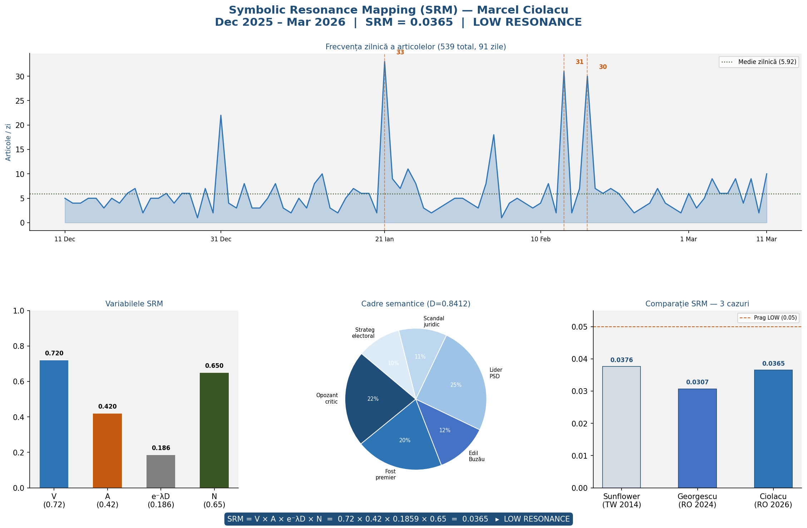
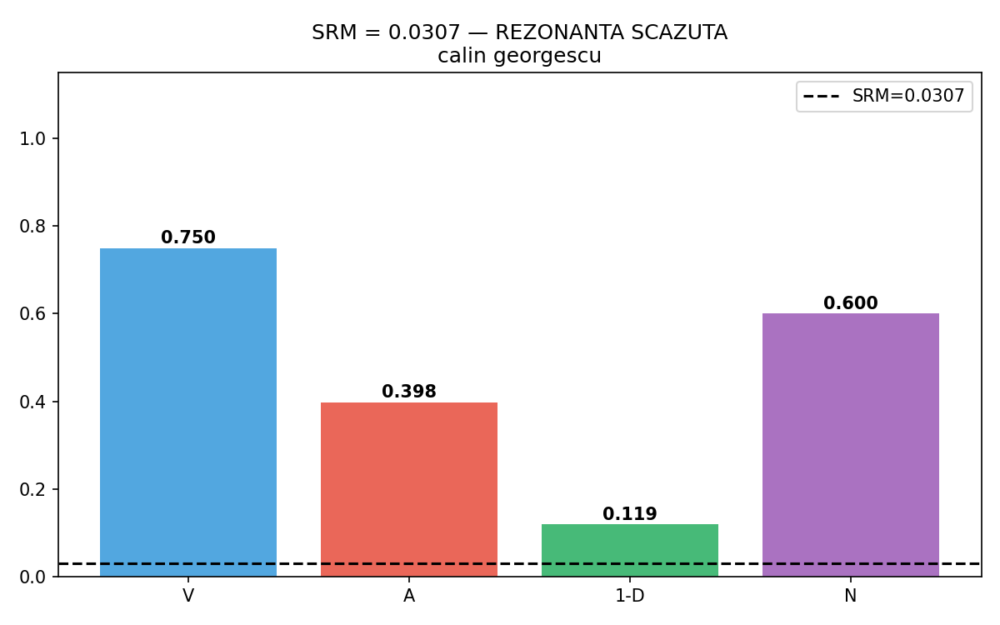

# Politomorphism

**Author:** Serban Gabriel Florin  
**Version:** 1.1 · 2026  
**License:** CC-By Attribution 4.0 International  
**DOI:** https://doi.org/10.17605/OSF.IO/YA9VQ

---

## What is Politomorphism?

Politomorphism is an original theoretical framework for analyzing the diffusion and transformation of political symbols. A symbol is politomorphic to the degree that the same signifying form condenses divergent meaning configurations for distinct political communities.

---

## Models

### Symbolic Resonance Mapping (SRM)

This is the general formula as defined in the official preprint:

**SRM = V · A · e^(−λD) · N**

- **V** — Visibility / Velocity: The speed and clarity of the symbolic transmission.
- **A** — Affiliation / Amplitude: The intensity of the connection between the group and the symbol.  
  *In computational validations, this variable is operationalized through measurable proxies such as affective weight (sentiment analysis), but its theoretical meaning remains affiliation/amplitude.*
- **e^(−λD)** — Exponential Decay: Signal loss based on cultural distance (*D*) and decay constant (*λ*).
- **N** — Network Density: The total size and connectivity of the target audience nodes.

---

### Entropic Equilibrium Function (EEF)

S(t) = −Σ p_i(t) · log(p_i(t))

dS/dt = Π(t) − Φ(t)

---

### The Politomorphism Engine: How It Works

The model operates as a multi-stage feedback loop:

1. **Input & Transmission (SRM):** Determines the initial resonance "charge" and calculates how far the message travels through the network before fading.
2. **Systemic Impact (EEF):** Measures whether the resulting social energy remains stable or leads to chaotic entropy.

---

## Live Demos

- [SRM Interactive Model](index.html)
- [Landing Page](politomorphism_landing_ro.html)

---

## Academic Citation

**DOI** 10.5281/zenodo.18962821

Serban Gabriel Florin (2026). *Politomorphism: Symbolic Resonance Mapping (SRM) and the Entropic Equilibrium Function (EEF).* OSF. https://doi.org/10.17605/OSF.IO/YA9VQ

Serban, G. F. (2026). *Politomorphism Research Project: SRM Framework, Computational Validation, and Case Studies.* Zenodo. https://doi.org/10.5281/zenodo.18962821

---

## Case Study 1: SRM Validation — Marcel Ciolacu

**Period:** December 2025 – March 2026

Raw data and semantic drift calculations for this case study can be found in the `/data_ciolacu` folder.

### Validation Results

| Variable | Name | Value |
|----------|------|-------|
| **V** | Viral Velocity | 0.73 |
| **A** | Affiliation / Amplitude | 0.42 |
| **D** | Semantic Drift | — |
| **e^(−λD)** | Exponential Decay (λ=2) | 0.1858 |
| **N** | Network Coverage | 0.65 |

**SRM = V × A × e^(−λD) × N = 0.73 × 0.42 × 0.1858 × 0.65 = 0.0365 → LOW RESONANCE**

[View the complete dataset here](data_ciolacu/)

---

## Case Study 2: SRM Validation — Călin Georgescu

**Period:** November – December 2024

### Validation Results

| Variable | Name | Value |
|----------|------|-------|
| **V** | Viral Velocity | 0.75 |
| **A** | Affiliation / Amplitude | 0.398 |
| **D** | Semantic Drift | — |
| **e^(−λD)** | Exponential Decay (λ=2) | 0.119 |
| **N** | Network Coverage | 0.60 |

**SRM = V × A × e^(−λD) × N = 0.75 × 0.398 × 0.119 × 0.60 = 0.0307 → LOW RESONANCE**

[View raw data](SRM_raport_final.json)

---

## Case Study 3: SRM Validation — Donald Trump

**Period:** February 2015 – November 2016

### Validation Results

| Variable | Name | Value |
|----------|------|-------|
| **V** | Viral Velocity | 0.9580 |
| **A** | Affiliation / Amplitude | 0.5800 |
| **D** | Semantic Drift | 0.734 |
| **e^(−λD)** | Exponential Decay (λ=2) | 0.2660 |
| **N** | Network Coverage | 0.7200 |

**SRM = V × A × e^(−λD) × N = 0.9580 × 0.5800 × 0.2660 × 0.7200 = 0.0922 → MEDIUM RESONANCE**

[View raw data](SRM_trump_result.json)

---

## Case Study 4: SRM Validation — Sunflower Movement

**Period:** March – April 2014 (validation run: March 2026)

Raw data and semantic drift calculations for this case study can be found in the `/data_sunflower` folder.

### Validation Results

| Variable | Name | Value |
|----------|------|-------|
| **V** | Viral Velocity | 0.750 |
| **A** | Affiliation / Amplitude | 0.393 |
| **D** | Semantic Drift | 0.7737 |
| **e^(−λD)** | Exponential Decay (λ=2) | 0.2128 |
| **N** | Network Coverage | 0.600 (12 countries) |

**SRM = V × A × e^(−λD) × N = 0.750 × 0.393 × 0.2128 × 0.600 = 0.0376 → LOW RESONANCE**

### The Resonance Paradox

This case demonstrates the *resonance paradox*: a symbol with high viral velocity (V=0.75) and broad international coverage (N=0.60, across 12 countries) registers low effective political resonance due to high semantic drift (D=0.7737). The exponential penalty e^(−λD) compresses the semantic factor to only 21.28% of its potential value, meaning the symbol circulates with meanings so fragmented that coherent political mobilization becomes practically impossible.

**Countries represented in corpus:** Taiwan, United States, United Kingdom, Japan, Hong Kong, Australia, France, Germany, Canada, South Korea, Singapore, Netherlands

[View raw data](./data_sunflower) | [SRM Report](SRM_sunflower_result.json)
